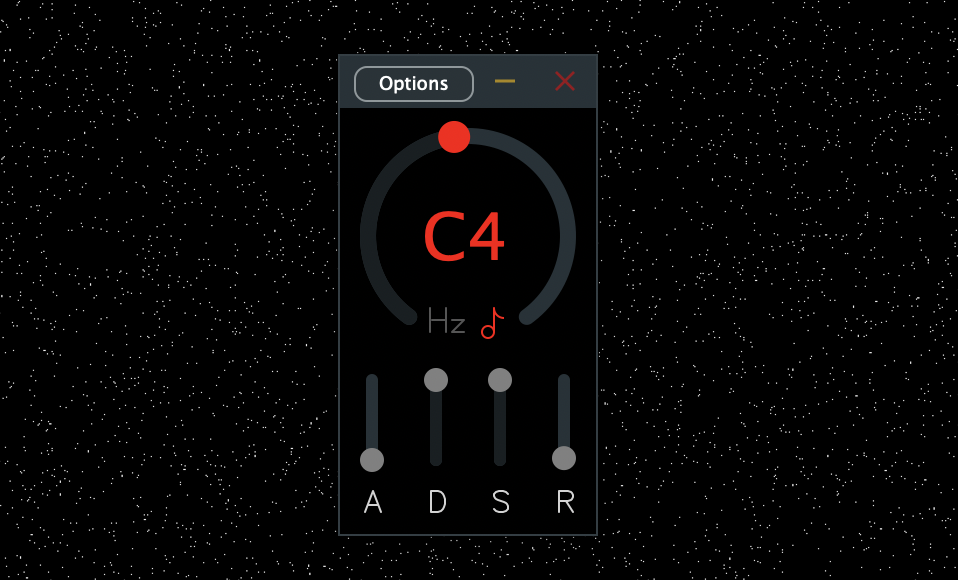

# Repitch

is a real-time, MIDI-polyphonic, pitch-shifting audio plugin. It uses a [Variable Delay Line](http://msp.ucsd.edu/techniques/latest/book-html/node115.html) and was made with [JUCE](http://www.juce.com).

To play it, add a sidechain input and play some MIDI notes — the input will be pitch-shifted by the interval between the played notes and middle C.

## [Download Standalone](https://github.com/maxwellpollack/repitch/releases/latest/download/Repitch.app.zip) | [Download AU](https://github.com/maxwellpollack/repitch/releases/latest/download/repitch.component.zip) | [Download VST](https://github.com/maxwellpollack/repitch/releases/latest/download/repitch.vst3.zip)
